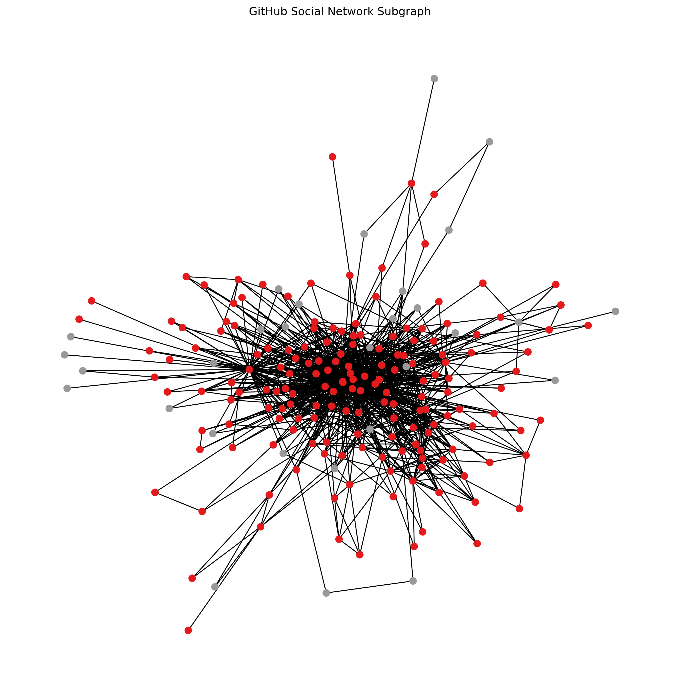

 
# OctoNode Cup 


# GNNs Mini Competition: GitHub Social Network Classification 
##

<p align="center">
What if we could predict user characteristics just by looking at how they connect with others?
</p>

##
##
## Repository Structure

Here is an overview of the repository and its key components:
```
OctoNode_Cup/
├── .github/
│   └── workflows/
│       ├── publish_leaderboard.yml
│       └── score_submission.yml        
├── competition/
│   ├── config.yaml
│   ├── evaluate.py
│   ├── metrics.py
│   ├── render_leaderboard.py
│   └── validate_submission.py
├── data/
│   ├── adjacency_matrix.npz
│   ├── musae_git_edges.csv
│   ├── musae_git_features.json
│   ├── node_features.npy
│   ├── test_target_without_labels.csv
│   └── train_target.csv
├── docs/
│   ├── leaderboard.css
│   ├── leaderboard.html
│   └── leaderboard.js
├── images/
│   └── graph_visualization.png
├── leaderboard/
│   ├── leaderboard.csv
│   └── leaderboard.md
├── starter_code/
│   └── baseline.py
├── submissions/
│   └── example_submission.csv
├── README.md
└── requirements.txt

```

## 💢Problem Description
The goal of this challenge is to perform binary node classification on a real-world GitHub social network graph. In this graph, each node represents a GitHub user, and edges represent social connections between users.

Your task is to build a model that leverages both node features and graph structure to predict whether a given GitHub user is primarily a Web Developer or a Machine Learning Developer.

Task Type:
* Node Classification
* Binary Classification
* Graph-Based Learning with GNNs
* Each node = one label:\
 1 → Web Developer.\
 0 → Machine Learning Developer.

## 🛢️Dataset
The GitHub Social Network dataset represents a real-world developer network where nodes correspond to GitHub users and edges represent social connections between them (such as following relationships). Each user is associated with feature information derived from their public activity, repositories, or profile characteristics.

The dataset contains:
* musae_git_edges.csv → Graph edges (source, target).

* musae_git_features.json → Node feature vectors.

* train_target.csv → Training labels.

* test_target.csv → Test nodes (labels hidden).

Graph Statistics:
* Nodes: ~37K.
* Edges: ~289K.
* Features: 128-dimensional node features.
* Task: Binary classification.

The dataset is split as follows:
| Split    | Percentage | Description                   |
| -------- | ---------- | ----------------------------- |
| Training | 70%        | Features + labels             |
| Testing  | 30%        | Features only (labels hidden) |

The test labels are stored in a private evaluation repository and are not accessible to participants to ensure fair ranking.

The competition dataset represents a graph 𝐺 = (𝑉,𝐸) where: 𝑉 = nodes and 𝐸 = edges.

🧩 Graph Components:
* Adjacency Matrix:
File: [adjacency_matrix.npz](data/public/adjacency_matrix.npz)

Shape: (N, N)

Type: Sparse matrix

The adjacency matrix 𝐴 represents connections between nodes.
If node i is connected to node j, then: 𝐴ᵢⱼ = 1 Otherwise: 𝐴ᵢⱼ = 0

* Node Feature Matrix
File: [node_features.npy](data/public/node_features.npy)

Shape: (N, F)

Each row corresponds to one node.
Each column represents a feature.

$X \in \mathbb{R}^{N \times F}$


Where:
𝑁 = number of nodes and 𝐹 = number of features.

The GitHub Social Network dataset used in this challenge is publicly available through the Stanford Network Analysis Project (SNAP).

🔗 **Dataset link:**  [Dataset](https://snap.stanford.edu/data/github-social.html)

### Graph Visualization (Subgraph)

The figure below shows a subgraph extracted from the original MUSAE GitHub dataset.

Due to the large size and high density of the full graph, only a subset of nodes and their corresponding edges are visualized for clarity.

Nodes represent GitHub users and edges represent follower relationships.
<p align="center">
  
</p>


## Evaluation Metric

The challenge is evaluated using **Macro F1-score**.

The F1-score is defined as:

$$ F1 = 2 \cdot \frac{\text{Precision} \cdot \text{Recall}}{\text{Precision} + \text{Recall}} $$

Where:

$$
\begin{aligned}
\text{Precision} &= \frac{TP}{TP + FP} \\
\text{Recall} &= \frac{TP}{TP + FN}
\end{aligned}
$$


For binary classification, we compute the F1-score independently for each class and then average them:

$$ \text{Macro F1} = \frac{F1_{\text{class 0}} + F1_{\text{class 1}}}{2} $$


### Why Macro F1?

- Ensures balanced performance across classes  
- Prevents majority-class bias  
- Standard metric in graph node classification research  

Submissions will be ranked by **Macro F1-score on the hidden test set**. Higher Macro F1 values indicate better overall classification quality across all classes.

## 🚧Difficulties and Challenges

This mini-challenge presents several challenges commonly encountered in real-world graph learning tasks:
- High-dimensional sparse node features.
- Class imbalance across labels.

## ⚠️Constraints
To ensure fair competition:
1. No External Data, only the data provided for this challenge may be used.
2. No external node features, it must be derived solely from the given dataset.
3. No pretrained embeddings or models, all models must be trained from scratch using the provided data.
4. Keep your model simple and interpretable (deeper is not always better).
   
Think of this as a “from-scratch GNN challenge”, no shortcuts, no pretrained magic, just pure graph learning✨

## 📤Submission
Ready to compete? Follow these steps to get your model on the leaderboard 
* Each participant must fork this repository to their GitHub account.
* Each participant needs to use the provided starter code as a baseline and implement your GNN model (while respecting all constraints!).
* After generating predictions on the test set, save them as a CSV file with the required format:\
   id , name , ml_target .
* Ensure:
    The file contains predictions for all test nodes.\
    The order of IDs matches test_nodes.csv.\
    The file name is your_team_name_submission.csv
* To ensure fair evaluation, all submissions must be encrypted before being uploaded. Use the provided public key:
 ```
python encryption/encrypt.py your_team_name_submission.csv encryption/public_key.pem submissions/your_team_name_submission.enc
```
This generates: your_team_name_submission.enc
* Move the encrypted .enc file into the submissions/ folder, commit and push your changes and open a Pull Request to the main repository.
* Once your Pull Request is opened:\
    Your submission will be automatically evaluated.\
    The score will be computed using the hidden test labels.\
    Your result will be added to the leaderboard.

 🌟Higher scores climb higher🌟
  
## 🏆Leaderboard
The competition features a **dynamic, automatically updated leaderboard**.
* All scores are stored and displayed in real-time on docs/leaderboard.html.
* Participants are ranked according to the official evaluation metric (Macro F1-score).
* Each entry shows: Rank, Team Name, Score, and Submission Date.
* The leaderboard updates automatically whenever a valid submission is made via a Pull Request, no manual intervention is needed.

✨Watch your team climb the ranks as you submit! 

[View the live leaderboard](https://El-Ikram.github.io/OctoNode_Cup/leaderboard.html)


## 🗓️Timeline
Start Date: 02/20/2026

Submission Deadline: 03/15/2026

## 🚨Disclaimer

This challenge is intended for educational purposes only.

## ❓ FAQ

**Q: Can I use CNNs or Transformers?**  
A: No. This is a GNN-only challenge.

**Q: Can I use pretrained models?**  
A: No pretrained embeddings or models are allowed.

**Q: Can I submit multiple times?**  
A: Not this time! Each team can submit only once, so take a moment to double-check your model and results.

**Q: Can I submit after the deadline?**
A: No, unfortunately submissions are not accepted after the deadline.


## 📚References
* Basira's lab lectures on GNNs: [DGL_Videos](https://www.youtube.com/watch?v=gQRV_jUyaDw&list=PLug43ldmRSo14Y_vt7S6vanPGh-JpHR7T).
* Dataset: [Dataset](https://snap.stanford.edu/data/github-social.html).

## 📄License
This project is released under the **MIT License**.  
You are free to use, modify, and distribute the code for research and educational purposes, with proper attribution.\
The GitHub Social Network dataset is provided by Stanford Network Analysis Project (SNAP) and is subject to its original license and usage terms.

See the [LICENSE](LICENSE) file for details.

##
<p align="center"><b>Don’t worry about being perfect, just try!</b></p>
<p align="center"><b>Good Luck!🤝</b></p>
